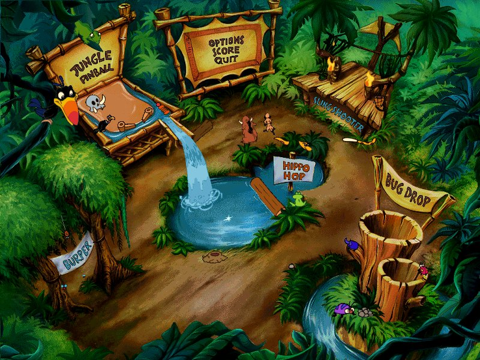
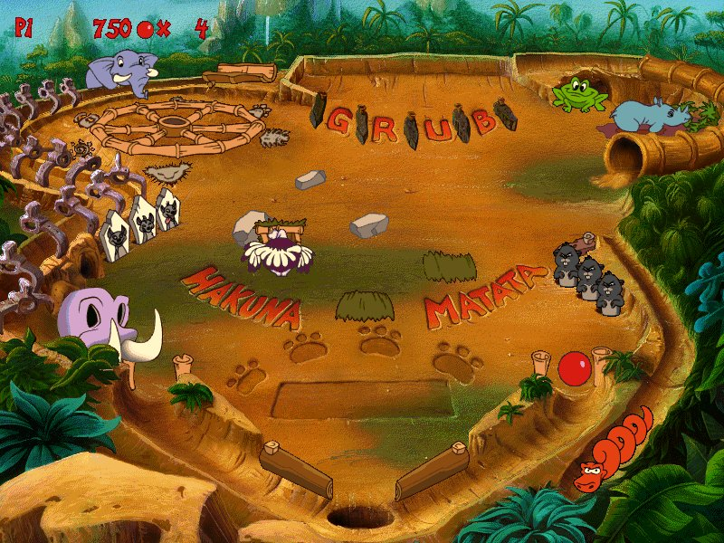
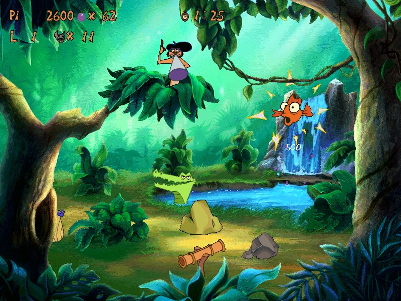
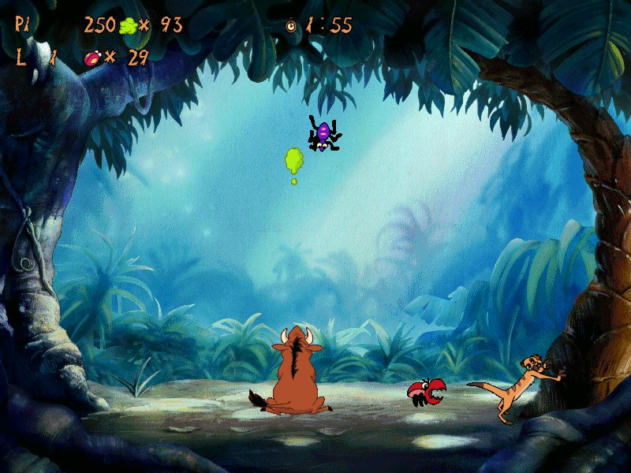
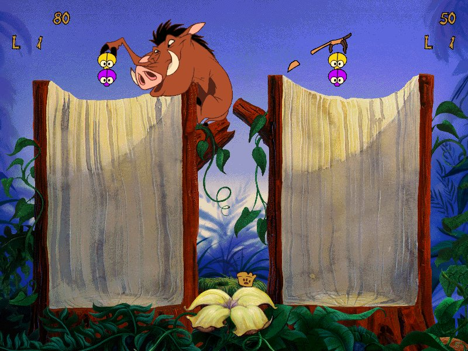
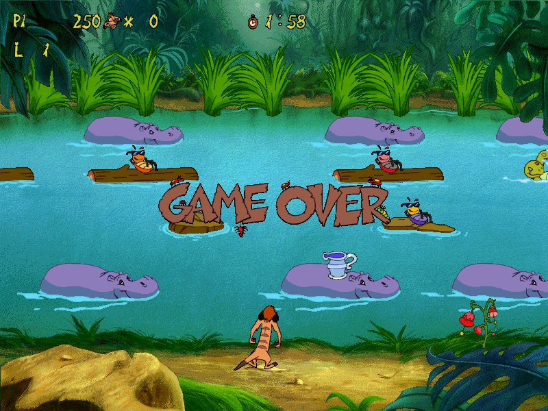
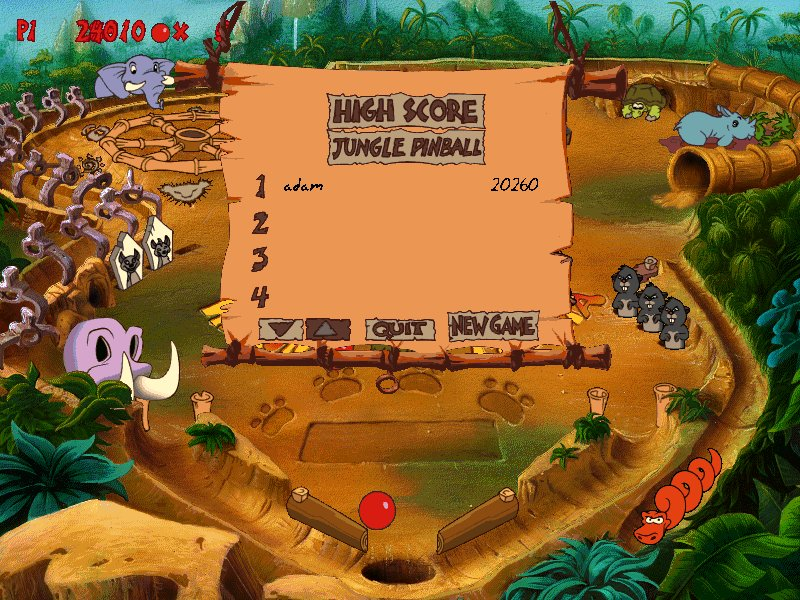
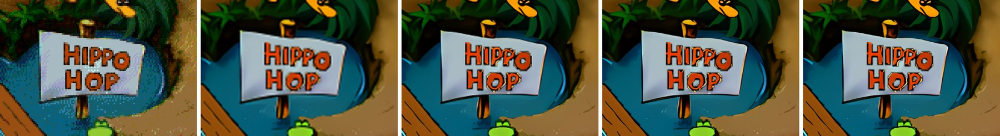
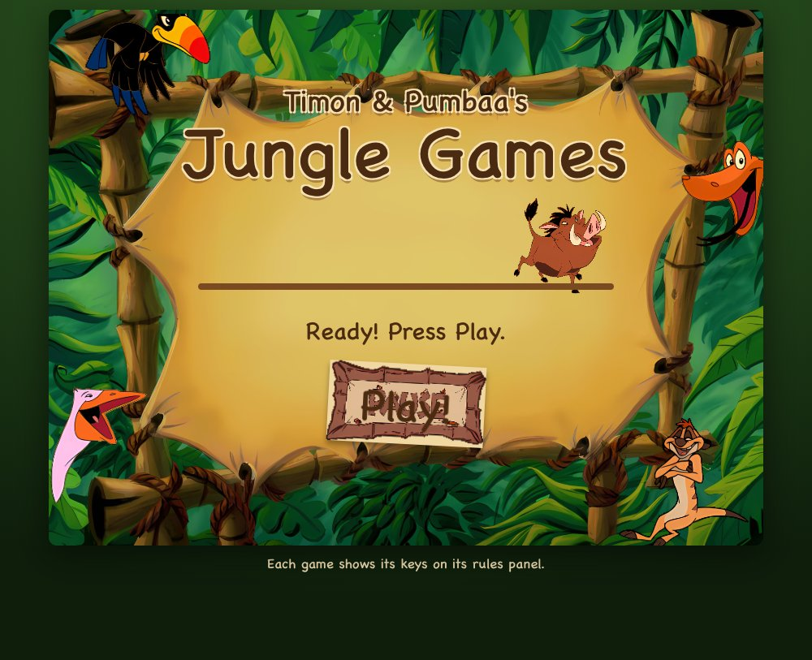
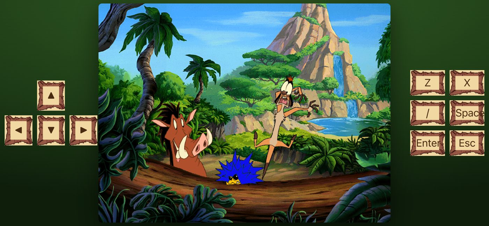

# jungle-recomp

A new, portable implementation of the engine behind *Timon & Pumbaa's Jungle Games*
(7th Level / Disney Interactive, 1995), reverse engineered from the original Windows 3.1 binaries.
It runs the game's own data files, unmodified, on macOS, Linux, Windows, iPad/iPhone,
PS Vita and in the browser (WebAssembly).

**Bring your own disc.** No game data is in this repository. You need your own copy of the CD
(or an image of it); the engine reads the files in its `JUNGLE` directory.

| | |
|---|---|
|  |  |
|  |  |
|  |  |

Every screenshot above is a real frame from this engine, captured while a bot played the game
(`tests/bots.py`). The Pinball high score below was set by the bot.



## What works

- All five games play start to finish: Hippo Hop, Burper, Bug Drop, Sling Shooter and Jungle Pinball.
  The intro, main menu, Options, Score and credits screens all work.
- Sound effects and speech (7th Level's 4-bit ADPCM), and the music, which is General MIDI played
  through a small built-in synthesiser.
- High scores and settings are saved in the game's own `7THLEVEL.INI` format.
- Keyboard, mouse, touch and game controllers.
- An optional **high-resolution art pass**: every bitmap on your disc upscaled with Real-ESRGAN and
  drawn at your display's full resolution (F9 cycles between the original pixels and the upscaled 1x-4x).



The game logic is the original's: the engine interprets the scene scripts on the disc, the same
way `JUNGLE.EXE` did. Nothing is re-authored.

## Getting the game files

From the CD, or a disc image, copy the `JUNGLE` directory. The engine needs `JUNG*.BIN`,
`HYENA.TTF`, `JUNGA01.DLL` and `JUNGU01.DLL` (the two DLLs are read for their sound and
trigonometry tables, never executed). `orig/CHECKSUMS.sha256` lists the checksums of the disc
this was built against.

```sh
# a disc image on macOS
hdiutil attach JUNGLE_ADVENTURE.ISO
mkdir -p orig/cd && cp -R /Volumes/*/JUNGLE orig/cd/
```

## Building and playing

| Platform | Build | Notes |
|---|---|---|
| macOS | `brew install sdl2 && make && ./jungle` | finds `orig/cd/JUNGLE`, or `JUNGLE/` beside the binary |
| Linux | `apt install libsdl2-dev && make && ./jungle` | or CMake |
| Linux AppImage | `make appimage` (podman or docker) | one file; finds or fetches the disc, see below |
| Windows | `make windows` (MinGW-w64 cross build) | copy `JUNGLE/` next to `jungle.exe` |
| iPad / iPhone | `tools/build_ipa.sh <team id>` | a signed `.ipa` for sideloading; see below |
| Web | `web/build.sh` (Emscripten) | see below |
| PS Vita | `cmake -DVITA=ON ...` (VitaSDK) | `jungle.vpk`; data in `ux0:data/jungle/` |

Full details for each platform are in [docs/PLATFORMS.md](docs/PLATFORMS.md).

### Linux AppImage

`make appimage` (or `tools/appimage/build.sh`) builds `build/appimage/Jungle_Games-x86_64.AppImage`
inside a container (`tools/appimage/Containerfile`: Ubuntu 22.04, SDL2 built with every video and
audio backend loaded at run time), so the file carries only the engine and libSDL2 and runs on
any x86-64 distribution with glibc 2.34 or later. It holds no game data. On first run it looks
for the disc and unpacks its `JUNGLE` directory into `~/.local/share/jungle-games`:

1. a path on the command line, `$JUNGLE_DATA` (a `JUNGLE` directory) or `$JUNGLE_ISO` (an image);
2. a `JUNGLE` directory beside the AppImage;
3. a disc image (`JUNGLE*.ISO`, `*TIMON*.ISO`) beside it, in `~/Downloads`, `~/Games`, on mounted
   drives and network shares (`/mnt/*/isos`, `/mnt/*`, `/run/media/*/*`), or in the directories
   listed in `~/.config/jungle-games/search`;
4. otherwise, if you agree, the image from archive.org, checked against its sha256.

The engine unpacks ISO 9660 itself (`jungle --extract-iso IMAGE DEST`), so nothing else is
needed. For a handheld, add the AppImage to Steam as a non-Steam game; Steam Input's pad is
picked up like any other.

### iPad and iPhone

`tools/build_ipa.sh <your Apple team id>` builds a signed `.ipa` with Xcode's automatic signing
and bundles your `orig/cd/JUNGLE` into it. The iOS project is `ios/CMakeLists.txt`. Install it with
`xcrun devicectl device install app --device <id> "build/ios-xcode/ipa/Jungle Games.ipa"`, or drag it
onto the device in Finder. It needs an Apple ID signed in to Xcode whose team has the device
registered.

- The app runs full screen in landscape. Touch and trackpad act as the mouse.
- An iPad keyboard works as the PC keyboard: arrows, letters, Enter, Space, Shift and Ctrl.
  It has no Esc key, so `` ` `` and Cmd+. stand in for it.

### Web

`web/build.sh` compiles the engine to WebAssembly into `web/dist`. The page asks the player for
their `JUNGLE` folder or a disc image (it reads ISO 9660 in the browser), and keeps the files in
IndexedDB so the next visit starts at once. Nothing is uploaded. Phones get on-screen buttons,
and holding a phone sideways gives a handheld layout.

`tools/web_ui.py` dresses the page in the game's own art: the Score screen's bamboo frame, Zazu,
the snake, Timon and the pelican round the edge, Pumbaa as the loading bar, and the HYENA font.
Like everything else, that art is taken from your disc, not stored here.




If you host a copy that includes game data, gate it (the page supports a server-provided
`data/manifest.json`); the data is not yours or mine to redistribute.

## Controls

Each game lists its keys on its rules panel. For example, Hippo Hop uses the arrows plus X and Z,
and Pinball uses Z and / for the flippers, the up arrow for both, Enter to launch and Space to shake.
Controllers work in every game, including two-player Bug Drop on one pad split Joy-Con style;
the mapping is in [docs/CONTROLLERS.md](docs/CONTROLLERS.md).

## Testing

`make e2e` plays the whole game headless in a few seconds (`tests/e2e.py`). It checks that:
- the game boots to the menu, and every menu choice opens its scene;
- sound stays in step with the game clock, sample for sample;
- music and the Options screen work;
- every scene runs without an unimplemented opcode;
- runs are deterministic;
- a bot for each game plays it from the menu to game over, beats a pre-filled high-score table and
  types its name.

The bots drive the engine through `./jungle FILE.BIN --drive`, a line protocol that steps time and
reads sprites and script variables (`tests/drive.py`).

## How it was made

The engine was reverse engineered from the five original NE binaries (`JUNGLE.EXE`, `JUNGR01`,
`JUNGS01`, `JUNGA01` and `JUNGU01.DLL`, about 158 KB of code) with Ghidra, a set of purpose-built
Python tools, and a lot of reading of 16-bit x86. The investigation log, including every wrong turn,
is [docs/FINDINGS.md](docs/FINDINGS.md). The data formats are in [docs/FORMAT.md](docs/FORMAT.md).
The story of how it was done is [blog.md](blog.md).

Some working artefacts are generated from your disc and not stored here:

| Artefact | Regenerate with |
|---|---|
| per-segment reference bytes (`reference/`) | `tools/ne_extract.py` |
| Ghidra decompilation (`notes/decomp/`) | `ghidra_scripts/ExportDecomp.java`, headless (see FINDINGS round 2) |
| scene script listings (`notes/script-*.txt`) | `tools/script_dis.py` |
| upscaled art (`build/hires/`) | `make hires` / `tools/upscale.py` |
| web page art (`build/web-ui/`) | `tools/web_ui.py` |

## Legal

*Timon & Pumbaa's Jungle Games* and all of its art, sound, music and scripts are the property of
their owners. This repository contains only original code and documentation. Please own the game.

Third-party code: stb_truetype and stb_image (public domain / MIT), SDL2 (zlib) at build time.
