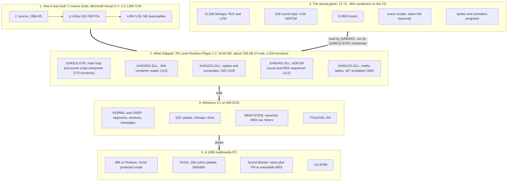
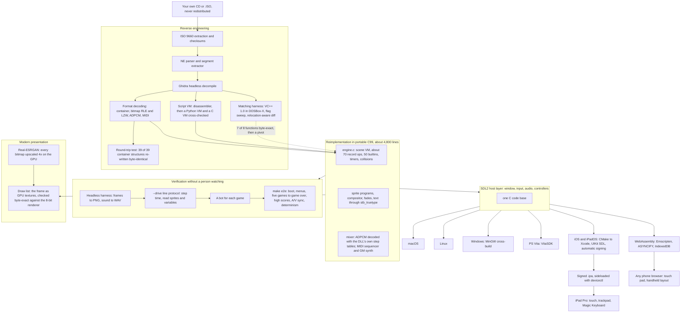
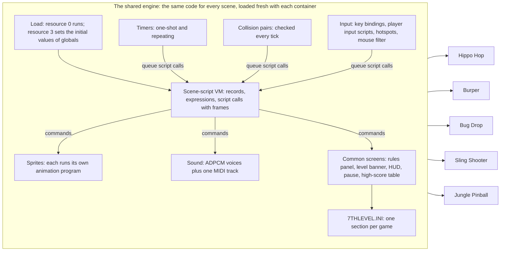

# Before and after: from a 1995 Windows 3.1 CD to an iPad

This page explains how *Timon & Pumbaa's Jungle Games* was built in 1995, how it was taken apart,
and how it was rebuilt to run on modern hardware. The first diagram shows the original stack from
the hardware up. The second follows the reverse-engineering pipeline from the assembly to the
iPad. The table after each one names the techniques used and what each one gained.

## Before: the game as it shipped in 1995

The key fact is layer 3: **the executable is not the game**. `JUNGLE.EXE` is 7th
Level's general-purpose Runtime Player. The five games, the menus and the intro all live in the
data containers as bitmaps, sounds and bytecode scripts. Understanding the player is therefore
enough to run everything.

### Techniques for understanding the original, and what each gained

| Technique | What it is | What it gained |
|---|---|---|
| Disc fingerprinting | SHA-256 of every file on the CD image | a fixed reference, so every finding refers to known bytes |
| NE header analysis | parsing the Windows 3.1 "New Executable" format: segments, relocations, imports and exports | a map of the five modules; the linker version (5.50) from the header |
| Headless decompilation | Ghidra, driven by script with no GUI | all 1,534 functions as readable (if rough) C, searchable with grep |
| Import and ordinal resolution | matching the stripped DLL exports (`S_001`...) to the Windows and in-game functions that call them | which DLL does what, although the exports carry no names |
| Call-graph mapping | who calls whom, per module | the script interpreter and the main loop, found in a 775-function EXE |
| Toolchain fingerprinting | linker version, prologue shapes and runtime-library code | the compiler identified as Visual C++ 1.0, with its exact flags |

## After: from the assembly to the iPad

### Techniques for rebuilding it, and what each gained

| Technique | What it is | What it gained |
|---|---|---|
| Corpus-wide validation | every hypothesis about a format is checked against every file on the disc, not a sample | wrong guesses fail at once; "works on this file" never passed for done |
| Round-trip re-serialisation | read a structure, write it back, and compare | proof the container format is fully understood (39 of 39 byte-identical) |
| Codec recovery from assembly | reading the decompression loops instruction by instruction | both bitmap codecs and the ADPCM, so every asset decodes |
| Reading tables from the original binaries | the ADPCM step tables and the sine and tangent tables are loaded at run time from the user's own DLLs | bit-exact arithmetic, without copying anything out of the game |
| Cross-validated interpreters | the same script VM in Python and in C, run side by side | confidence that the C matches the understanding, with differences caught at once |
| Opcode census | counting which record types the scenes actually execute | showed that the remaining engine work was small, and which parts came first |
| Matching decompilation | recompiling C with the 1995 compiler until the bytes are identical | exact semantics for the resource DLL; later a reference, not the route |
| Emulated guest | Windows 3.1 in QEMU and DOSBox-X, driven by scripted keystrokes | a way to watch the real game, and a check on assumptions |
| Look at the output | render a scene to PNG and view it | found the palette-base bug that every numeric check had missed |
| Instruction-level transcription | rewriting a routine from the assembly, line by line | ruled out a suspected LZW bug and moved the search elsewhere |
| Reimplementation, not emulation | new portable C that follows the original's logic, verified against the disassembly | native speed on every platform, no Windows or x86 emulation |
| Deterministic headless simulation | the engine runs from a fixed clock, with no display | identical runs; a 10-minute game simulates in under a second |
| Differential audio analysis | two WAVs, music on and off, subtracted | isolated the music, and measured its level for tests |
| Sample-accurate clock test | samples mixed compared with elapsed game time | found the mixer running 6% fast, which caused sound drift |
| Scriptable drive protocol and bots | step, look and act, one line at a time | automated play of all five games, to high scores |
| Parallel sub-agents | a second AI worker decoding the MIDI format while the main one built the engine | music finished without pausing the engine work |
| Neural upscaling | Real-ESRGAN anime model over all 11,506 bitmaps | clean art at 3x to 4x for Retina and iPad screens |
| Draw-list rendering | the frame as a list of draws, verified identical to the 8-bit output | GPU drawing at any resolution with the game logic untouched |
| One host layer, many targets | SDL2 plus CMake, Emscripten, VitaSDK, MinGW and Xcode | six platforms from one code base |
| Bring your own disc | every tool that needs game data reads it from the user's copy | an open repository with no copyrighted material in it |

## Inside the engine: how each mini-game is built

Every scene, including each of the five games, is one `.BIN` container run by the same engine.
The engine supplies the parts below, and each container brings its own art, sounds, music and
scripts.

Each game follows the same outline. The rules panel appears on the first five plays, counted by
`Entries` in the game's INI section. Then comes a level banner, and a HUD with score, lives or ammo
and a clock. Play continues until time or lives run out, then the high-score table shows (a text
field if the score places) with QUIT and NEW GAME. The music starts only once play begins.

Measured from the engine while each game was being played (`--drive`, command `state`; resource
counts from the container directory):

| Game | Container | Bitmaps | Scripts | Sprites in play (running) | Timers | Other |
|---|---|---:|---:|---:|---|---|
| Hippo Hop | JUNGHIPP | 2,133 | 936 | 87 (48) | countdown every 1 s, plus 10 ms and 3 s one-shots | a player input script reads the keys; 1 looping music track |
| Burper | JUNGBURP | 847 | 369 | 70 (62) | none while playing | driven almost entirely by sprite programs and key state |
| Bug Drop | JUNGBUGD | 813 | 324 | 41 (25) | 100 ms one-shot | 2 hotspots (choose your log); a player input script |
| Sling Shooter | JUNGSHOT | 1,911 | 312 | 102 (61) | clock every 1 s | the mouse is the sling; the game warps the pointer back to the slingshot (op 73, `SetCursorPos`) |
| Jungle Pinball | JUNGPINB | 1,253 | 460 | 157 (79) | 3 s one-shot | 12 collision pairs; up to 3 balls; the physics is scripts over native helpers |

### Hippo Hop

- **Clock.** A repeating 1-second timer (script 524) counts the clock down in a global (g1855),
  and the HUD redraws from it.
- **Time up.** When the clock reaches zero, the handler registered for time-up (script 7048)
  plays Timon falling in, takes a life, and sets the clock back to 2:00. After the last life, the
  game ends.
- **Input.** Hopping goes through a *player input script*: the engine binds the keyboard to a
  player (ops 83 and 84) and hands the directions to a script, not to fixed key bindings.
- **Scene.** The lanes of hippos are sprites looping their own animation programs. Hippo Hop is the
  largest container on the disc (936 scripts, 3,149 positioned bitmaps).

### Burper

- **No timers.** Almost nothing is timer-driven while playing. 62 of its 70 sprites are running
  their own programs, and the scripts read key state directly.
- **Keys.** The keys are X and the arrows.

### Bug Drop

- **Two players.** The game first asks each player to choose a log. These are two hotspots, and the
  game waits until one is clicked.
- **Input.** Moving goes through a player input script, like Hippo Hop. One helper in this game
  tags each sprite with its owner; the port had first stored the sprite's handle there instead of
  its index, and that one wrong value broke the log switch until it was fixed.

### Sling Shooter

- **Aiming.** Targets pop up as sprites, and the mouse aims and fires. After a shot, the game puts
  the pointer back on the slingshot with `SetCursorPos`. The port maps that to the real pointer
  through the window's letterboxing.
- **Clock.** A repeating 1-second timer runs the clock. Space skips the intro.

### Jungle Pinball

- **Ball state.** Pinball is the one game with real physics, and it is written in the game's own
  scripts. Up to three balls are kept in global arrays: x (g1900), y (g1903), speed (g1894),
  angle in tenths of a degree (g1897), and in play (g1917).
- **Each tick.** A per-ball script (720, then 721) moves each ball. It steps the ball along its angle
  to the edge of a box with a native ray-to-box routine (op 50, using JUNGU01's tangent table). It
  tests the result against the table's walls and posts with a point-on-sprite check (builtin 0x8A),
  and dispatches the fixture that was hit (script 1688). Bounces use native elastic-collision and
  reflection helpers (0x7C and 0x7F).
- **Controls.** Z and / flip. Enter held and released launches from the snake plunger. Space shakes
  the table, which nudges every ball's angle by a random amount (script 725).
- **The stuck ball.** The collision scripts can wedge a ball against the top corner of a post: it is
  turned back by one test and refused passage by the next, and it sits still at full speed. The port
  reproduces this faithfully. Shaking frees it, and the Pinball bot in `tests/bots.py` does exactly
  that.
